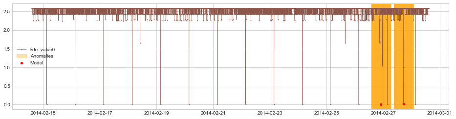
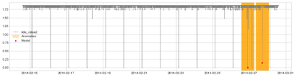
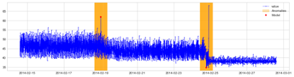
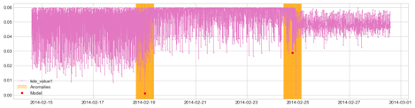
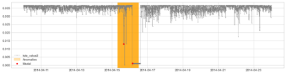

# 核密度高斯分布的应用
本次实验是如何使用高斯核密度分布对数据进行异常检测。

## 数据集
这里使用的是AWS监控指标数据集中的CPU使用率。AWS数据集是通过Amazon CloudWatch服务进行采集，采集间隔时间为5分钟。

## 高斯KDE
KDE核密度函数的参数为带宽和核密度函数。
  * 核密度函数设置为高斯函数。
  
  * 带宽反映了KDE曲线整体的平坦程度，即观察到的数据点在KDE曲线形成过程中所占的比重。因此，带宽越大，观察到的数据点在最终形成的曲线形状中所占比重越小，KDE整体曲线就越平坦。

## 实验结果分析
下图为，该数据集的异常点分布情况：

  

* 有效性
在该数据集下，带宽选择0.15时，两个异常点在总体分布中较为显著。

  

* 参数对比
可以看出，在这个数据集中，当KDE曲线越陡峭时，也就是相对来说带宽越小，异常点越明显。不同的数据集适合的带宽也不相同。

  
  
  
  

* 泛化性
在AWS的其他数据集中，KDE分辨异常点的效果并不理想。

  
  
  
  

