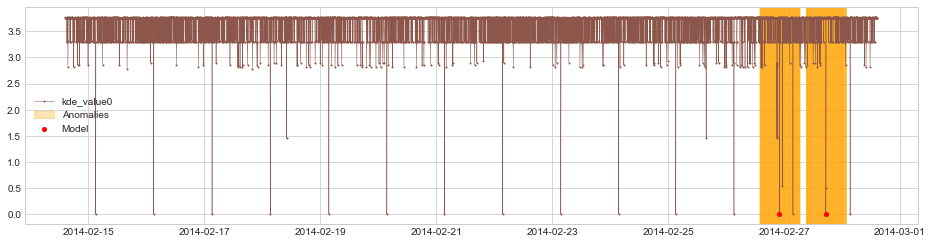

# 核密度估计算法的探索和实践
如何使用KDE算法（主要是高斯核密度估计）对监控数据进行分析。

## 算法
核密度估计方法，用于估计未知的密度函数，不依赖数据的先验知识和假设，属于非参数估计方法。
 * 公式如下所示：
 
 $$ \begin{aligned}
     \hat{f_h}(x) = \frac{1}{n} \sum_{i=1}^{n} K_{h}\left(x-x_{i}\right)=\frac{1}{n h} \sum_{i=1}^{n} K\left(\frac{x-x_{i}}{h}\right) 
 \end{aligned} $$

 * 主要参数包括：
   * 核密度函数： $K(.)$ 为核函数， 这里主要采用高斯核函数；
   * 带宽： $h>0$ ，平滑参数；
      * 当带宽越大，KDE整体曲线欠平滑（Undersmoothing），曲线的波峰过多，说明观察到的数据点在最终形成的曲线形状中所占比重越小；
      * 当带宽越小，KDE整体曲线过平滑（oversmoothing），曲线只有一个波峰，说明观察到的数据点在最终形成的曲线形状中所占比重越大；

  

## 数据
这里使用的是AWS监控指标数据集中的CPU使用率，具体参见 <a href="../data/README.md">数据说明.</a>

## 结果
下图所示为kde结果概率密度图，可以看出，概率密度log图的可分性要强于概率密度图，因此本文分析均采用概率密度log图。

  
   图1.1：概率密度log图

  
   图1.2：概率密度分布图

## 实验
这里包括四组实验，分别是：1. 有效性分析；2. 参数影响评估；3. 参数优化测试；4. 泛化性测试。

* 有效性分析
  * 这里采用数据集（ec2_cpu_utilization_24ae8d.csv），该数据集包括两个异常点，分布情况如下图所示；
  * 采用高斯核函数，带宽选择0.05；
  * 如下图所示，可以看到两个异常点明显突出，说明算法能够侦测到指标异常。 

  
   图2.1：原始数据集的分布状态

  
   图2.2：bw = 0.05

* 参数影响评估
  * 延用上个实验的数据集；
  * 这里KDE的带宽分别采用0.15、0.5、1、2；
  * 如下图所示，带宽越小，异常点越明显，也就是在当前数据集中，观察点的数据在曲线形状中占比越大，越容易发现异常。

  
   图3.1：bw = 0.15 （图改）

  
   图3.2：bw = 0.5  （图改）

  
   图3.3：bw = 1 （图改）

  
   图3.4：bw = 2 （图改）

* 参数优化测试
  * 延用上个实验的数据集；
  * 这里KDE的带宽用GridSearchCV来自动寻优；

<!-- 可以看出，在这个数据集中，，也就是相对来说不同的数据集适合的带宽也不相同。
 -->

* 泛化性测试
  * 使用AWS剩下四个数据集进行测试；
  * 不同数据集的KDE带宽参数不同；
  * 如下图所示，可以看到，KDE能够侦测到大多数节点上的指标异常，只有在图4.4中无法识别出异常点。

  
   图4.1：数据集：ec2_cpu_utilization_ac20cd.csv，bw = 0.15 （图改）

  
   图4.2：数据集：ec2_cpu_utilization_5f5533.csv，bw = 0.5 （图改）

  
   图4.3：数据集：ec2_cpu_utilization_825cc2.csv，bw = 1 （图改）

  
   图4.4：数据集：ec2_cpu_utilization_fe7f93.csv，bw = 2 （图改）

* 参考资料：[The importance of kernel density estimation bandwidth]
（https://aakinshin.net/posts/kde-bw/ ）
