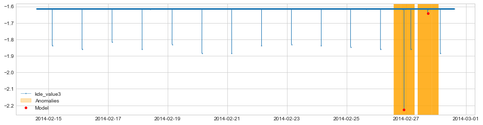

# 核密度估计算法的探索和实践
如何使用KDE算法（主要是高斯核密度估计）对监控数据进行分析。

## 算法
核密度估计方法，用于估计未知的密度函数，不依赖数据的先验知识和假设，属于非参数估计方法。公式如下所示：
 
$$ \begin{aligned}
     \hat{f_h}(x) = \frac{1}{n} \sum_{i=1}^{n} K_{h}\left(x-x_{i}\right)=\frac{1}{n h} \sum_{i=1}^{n} K\left(\frac{x-x_{i}}{h}\right) 
   \end{aligned} $$

其中，主要参数包括: $K(.)$ 表示核函数（这里主要采用高斯核函数）， $h>0$ 表示带宽，即平滑参数。

## 数据
测试使用AWS监控指标数据集，如下表所示。具体参见 <a href="../data/README.md">数据说明</a>。

| 标识 | 数据文件 | 数据说明 |
| :----: | :---- | :----: | 
| 24ae8d | ec2_cpu_utilization_24ae8d.csv | CPU使用率指标数据 | 
| ac20cd | ec2_cpu_utilization_ac20cd.csv | CPU使用率指标数据 | 
| 5f5533 | ec2_cpu_utilization_5f5533.csv | CPU使用率指标数据 | 
| 825cc2 | ec2_cpu_utilization_825cc2.csv | CPU使用率指标数据 | 
| fe7f93 | ec2_cpu_utilization_fe7f93.csv | CPU使用率指标数据 | 
|   -    | combined_labels.json           | 异常时间点 |
|   -    | combined_windows.json          | 异常时间窗口 |

## 实验
这里包括三组实验，分别是：1. 有效性分析；2. 参数影响评估；3. 泛化性测试。

### 有效性分析
* 这里采用数据集24ae8d，包括两个异常点，分布情况参见图1-1；
* 采用高斯核函数，带宽选择0.05；
* 结果如下所示，模型输出的两个异常点突出，说明KDE能够侦测到指标异常。 

<p align="center">
  
  </br>图1-1：数据集的分布情况。
</p>
<p align="center">
  
  </br>图1-2：KDE输出的分布结果。
</p>

### 参数影响分析
* 带宽会影响模型输出（曲线）的平滑程度。具体地，
  * 当带宽越大，容易造成过平滑（oversmoothing）
  * 当带宽越小，容易造成欠平滑（undersmoothing）


<p align="center">
  
  </br>图1-3：左图过平滑（曲线只有一个波峰），右图欠平滑（曲线的波峰过多），中间的图是需要找的合适带宽的模型结果。</p>


* 这里主要评估带宽（bandwidth）对模型结果的影响。
  * 延用数据集24ae8d；
  * 带宽分别采用0.05、0.5、1、2、10；
  * 结果如下所示，当带宽小的时候，模型能够侦测出当前数据集的异常点。带宽越大，异常点对应的模型输出不明显。

<p align="center">
  
  </br>图3.1：bw = 0.05，此时的异常点最为显著 
</p>
<p align="center">
  
  </br>图3.2：bw = 0.5  
</p>
<p align="center">
  
  </br>图3.3：bw = 1 
</p>
<p align="center">
  
  </br>图3.4：bw = 2 
</p>
<p align="center">
  
  </br>图3.4：bw = 10 
</p>


<!-- 可以看出，在这个数据集中，，也就是相对来说不同的数据集适合的带宽也不相同。
 -->

### 泛化性测试
* 这里展示另外四个数据集的结果；
* 采用高斯核函数，每个数据集采用调优的带宽超参值；
* 结果如下图所示，KDE能够预测到大部分异常点，说明KDE算法对分析指标异常有效。
 
<p align="center">
  
  </br>图4.1：数据集ac20cd，bw = 0.15 （图改）
</p>
<p align="center">
  
  </br>图4.2：数据集5f5533，bw = 0.5 （图改）
</p>
<p align="center">
  
  </br>图4.3：数据集825cc2，bw = 1 （图改）
</p>
<p align="center">
  
  </br>图4.4：数据集fe7f93，bw = 2 （图改）
</p>


## 实践经验

### log对输出的可分性影响
实验中，我们发现概率密度log图的可分性要强于概率密度图，因此本文分析均采用概率密度log图。  

在相同的时间窗内，橘黄色的标记点在log的空间内的差异性（左图）要远大于在线性空间（右图）。

<p align="center">
  
  </br>图2-1：对比图
</p>

抓取上图中橘黄色标记的数据进行分析，可以发现log后的概率密度值的离散程度要远比原概率密度值大。
| | kde_value_log | kde_value | 
| :----: | :---- | :---- | 
|2014-02-25 15:45:00 | -1.2058331818568409 | 0.2994424055696231| 
|2014-02-26 03:15:00 | -4.198649526087667 | 0.01501584163624678| 
|2014-02-26 21:00:00 | -1.2058331818568409 | 0.2994424055696231| 
|2014-02-26 21:10:00 | -1.1240620685483034 | 0.3249571119639012| 
|2014-02-26 22:05:00 | -6.225224069401886 | 0.0019788803591340915| 
|2014-02-26 23:15:00 | -3.8656822608116608 | 0.020948625134374274| 
|2014-02-27 03:40:00 | -4.191532988667018 | 0.015123083578193903| 
|2014-02-27 17:15:00 | -6.225223301953233 | 0.0019788818778237404| 
|2014-02-27 17:20:00 | -4.026548532860739 | 0.01783578346079108| 
|2014-02-28 03:20:00 | -4.647990030402703 | 0.00958083978700195| 
| std | 1.8262812369410844 | 0.13600538780765184 | 

异常点的概率密度值通常是无限趋近于0的极小值，在线性空间中难以区分，当置换成log空间后的可分性会增强，因此在做异常点识别的时候，我们使用的log后的概率密度函数做为输出。

### 模型参数优化

* 单个超参数且数值范围有限的情况下，这里采用GridSearchCV进行参数寻优。

```
kde_params = {"bandwidth": np.logspace(-1, 1, 20)} 
kde_grid = GridSearchCV(KernelDensity(kernel='gaussian'), kde_params, cv=5) 
kde_grid.fit(data)
best_kde = kde_grid.best_estimator_
```

* 模型优化的默认指标是最大化对数似然，即  $\sum log\hat{f}(x_{i})$

## 参考
* [The importance of kernel density estimation bandwidth]（https://aakinshin.net/posts/kde-bw/ ）
