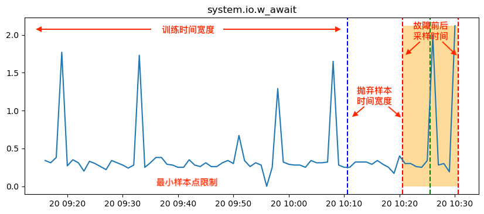
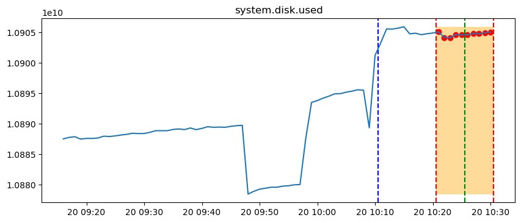
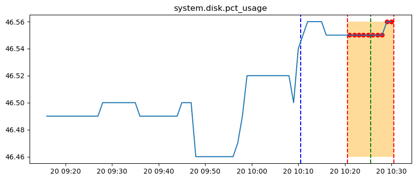

# 运维比赛方案
这里主要参考浦发团队在Aiops比赛中所使用的方案。

## 数据

## 预处理
1. 避免故障产生前后对样本的污染，对数据进行预处理：
* 防止污染有故障样本：丢弃故障早期和晚期的样本，避免指标异常不明显，污染有故障样本；
* 防止污染无故障样本：丢弃故障结束后一段时间的样本，避免指标异常持续时间长，污染无故障样本。

  
   图：数据预处理示例

案例：

  
   图：故障发生前有异常

  
   图：故障发生前有异常，因此需要抛弃

2. 将故障发生前，数据预处理完的无故障样本做为训练集数据；将故障发生前一段时间和故障发生后一段时间的样本作为测试集数据。

<!-- 【示例图，删除了可能被异常点污染的数据（异常发生前后t时间内的数据）】 
【训练集、测试集的划分】  -->

## 异常检测 
这里包括两个步骤。1. 预估； 2. 预警。
在此方案中，将KDE算法的输出，作为K-Sigma算法的输入，进行异常点的识别。

* KDE算法  
此方案，使用KDE算法进行异常检验，具体参见 <a href="../data/Gaussian-KDE-Application.md">核密度估计算法的探索和实践</a>。

* K-sigma算法  
K-sigma算法也是异常检测的一种。

## 结果分析
这里包括两组实验，1. 有效性分析；2. 时间窗分析。本次实验的数据集为cloudbed1下的node节点的node-1。

### 有效性分析 
<!-- [KDE明显（可以提取/完全没用）/不明显] -->
<!-- 用此方法能够区分出故障的发生，导致部分指标产生异常。 -->
用此方法能够区分出故障的发生，55个指标中能够找出34个异常指标。但有些指标能够看出明显的差异，有些肉眼无法判断是否有用，有些完全没用。

  
   图：该指标能够看出明显的差异

  
   图：该指标肉眼无法判断是否异常

  
   图：该指标完全没用

### 时间窗分析
可以看出，指标受故障影响产生异常的时间不一样

### 样本不对齐
