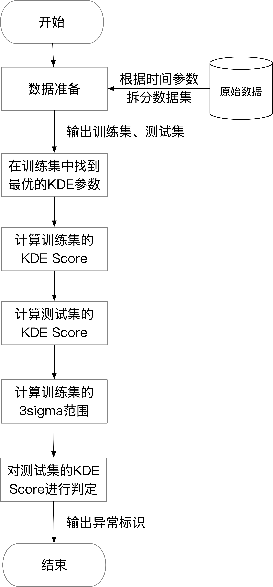
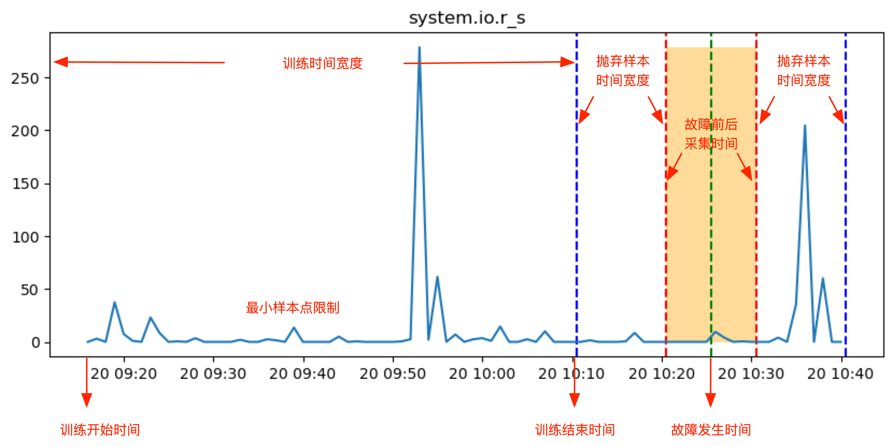
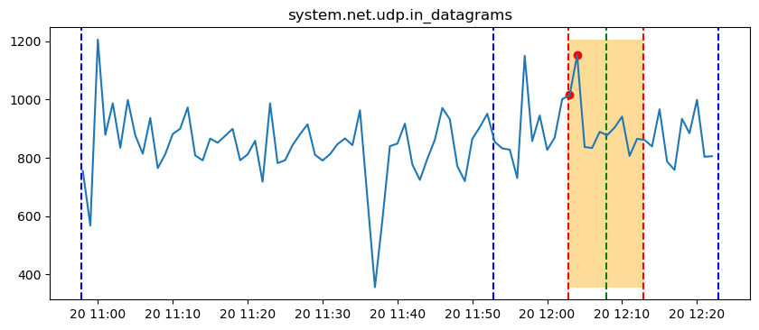
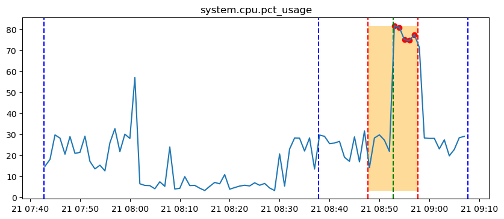
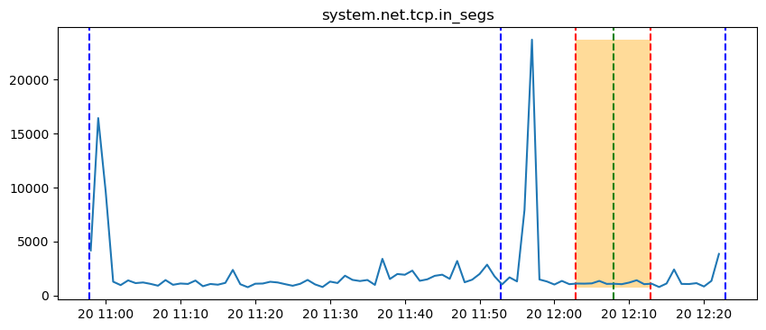
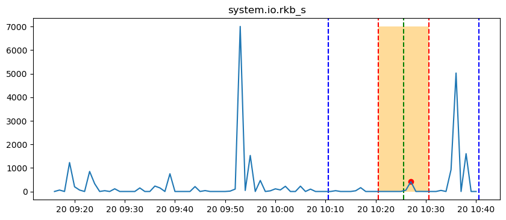
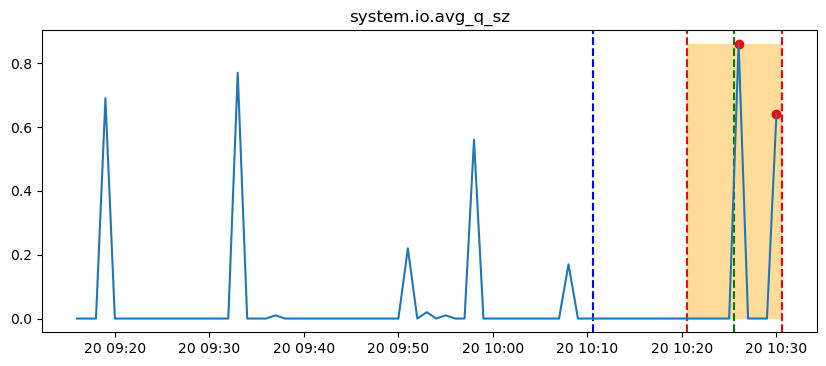
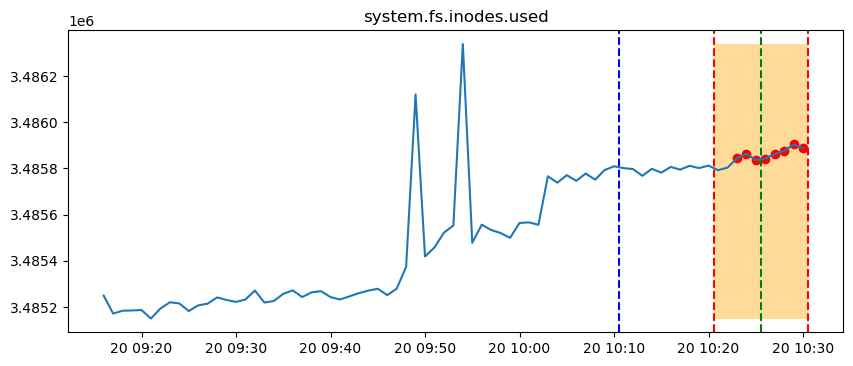
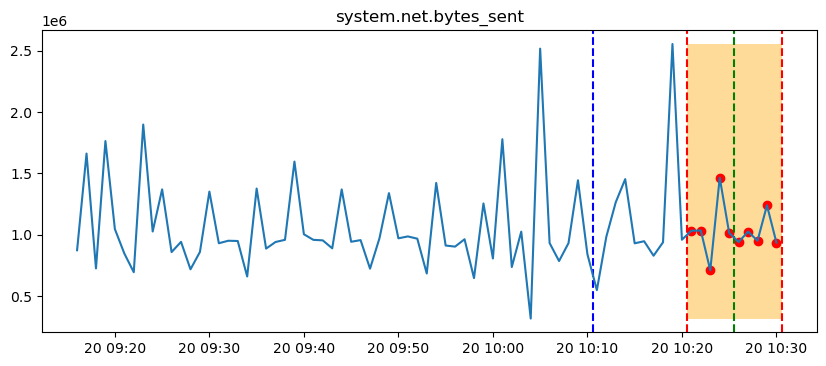

# 运维比赛方案
这里主要参考浦发团队在Aiops比赛中所使用的方案。

## 数据

这里使用的是国际AIOps挑战赛初赛数据集。本次实验的数据集为cloudbed1下的node节点的node-1。包括六列：时间戳（timestamp），CMDB对应的编号（cmdb_id），KPI对应的名称（kpi_name），KPI在该时刻对应的数值（value），CLOUD对应的编码（cloud），以及故障发生的日期（date）。数据集样例如下：
| timestamp | cmdb_id | kpi_name | value | cloud | date |
|  :----:  |  :----:  | :---- | :---- |   :----:   |  :----:  |
| 1647705600 | node-1 | system.cpu.iowait	| 0.31 | cloudbed1 | 2022-03-20 |
| 1647705600 | node-1 | system.net.packets_out.erro | 0.00 | cloudbed1 | 2022-03-20 |
| ... | ... | ... | ... | ... | ... |

该数据集详细统计情况如下：
| | KPI种类 | 数据集大小 | 时间天数 | 
| :---- | :----: | :----: | :----: | 
| 数据集 | 59 | 163872 | 2 | 

## 方案
目的：故障时，指标是否存在异常。
对象：该分析主要针对节点级的故障。具体地，对故障期间的节点指标进行异常检测。
方案：这里包括三个步骤。
1. 数据采集。
2. 预估。故障发生前一段时间的指标样本点，用于训练KDE模型，估计故障期间的指标样本点。
3. 预警。采用K-Sigma方法，对KDE估计（训练和测试）进行判定，输出异常标识。

  
   图：方案流程图

## 数据采集
由于只有故障发生时间点，没有时间范围，因此数据采集需要设置间隔时间（故障发生前后），确保样本污染。

  
   图：数据采集示例

案例：

  
   图：故障时间点前，指标异常示例

  
   图：故障时间点后，指标异常示例

2. 将故障发生前，数据预处理完的无故障样本做为训练集数据；将故障发生前一段时间和故障发生后一段时间的样本作为测试集数据。

  
   图：故障发生前，指标异常示例

  
   图：故障发生后，指标异常示例

### 有效性分析 
<!-- [KDE明显（可以提取/完全没用）/不明显] -->
<!-- 用此方法能够区分出故障的发生，导致部分指标产生异常。 -->
用此方法能够区分出故障的发生，55个指标中能够找出34个异常指标。但有些指标能够看出明显的差异，有些肉眼无法判断是否有用，有些完全没用。

  
   图：该指标能够看出明显的差异

  
   图：该指标肉眼无法判断是否异常

  
   图：该指标完全没用

### 时间窗分析
可以看出，指标受故障影响产生异常的时间不一样

### 样本不对齐

# 参考
1. 浦发方案：<a href="./external/浦智运维战队.pdf">[浦智运维战队]</a>
2. 农行方案：<a href="./external/ABC_AIOPS.pdf">[ABC_AIOPS]</a>
