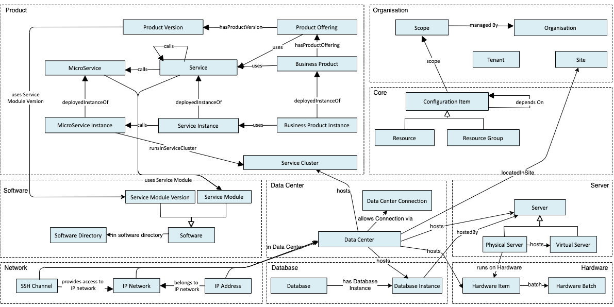
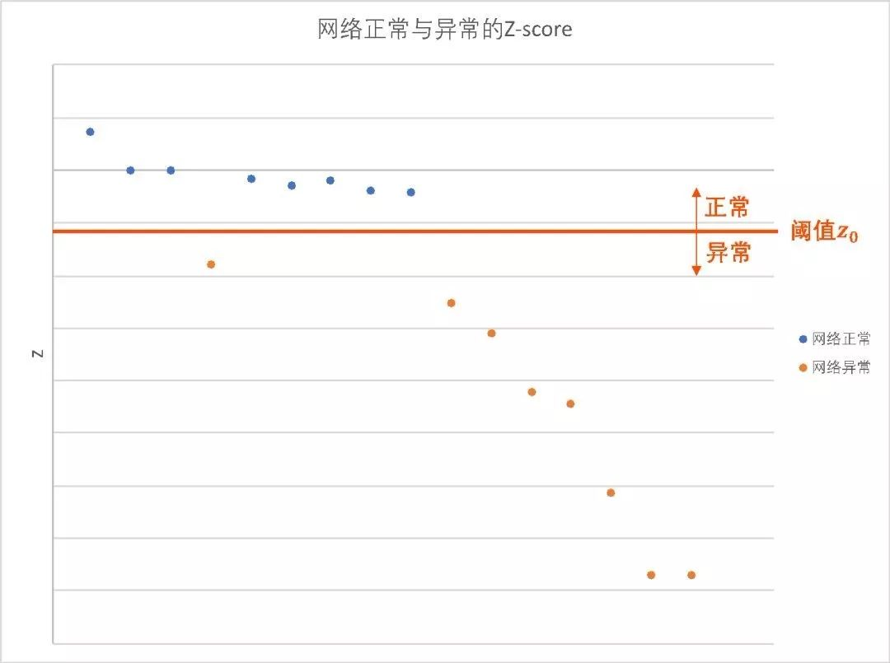

# 收集方法
这里会总结各种用于智能运维的方法。
	 
## 如何构图

* 华为本体工程组发布了一套基于本体论的图谱建设方案，如下图所示。 但是存在若干比较严重的问题：首先，该工作是爱尔团队做的，基本没有中文资料及推广，关注度相当低；其次，论文中提到的工具同样属于小众工具，使用并不方便（反正我没用成功，建议别用mac尝试）；最后，场景还是有较大差异，参考为主。
	* Paper: [A High-Level Ontology Network for ICT Infrastructures](https://davidchavesfraga.com/outcomes/papers/2021/corcho2021high.pdf)
	* Github：[https://github.com/oeg-upm/devops-infra](https://github.com/oeg-upm/devops-infra)

  

## 二项分布如何用于网络判障

* 场景

探测内网连通性（机房到机房），以服务器 $a$ 去探测服务器 $b$ 为例，每次探测有两种结果（成功，失败），假设发出 $n$ 个数据包，其中 $m$ 个成功， $n-m$ 个失败。 

* 问题

理论上，网络状态正常， $m/n=100%$ ，但实际上由于各种不确定性因素（服务器负载高、服务器重启，等），少量的数据包失败是可接受的。因此，需要设定一个判障阈值。

* 需求

人工设置阈值不合理，因为服务器之间连接情况不同，系统复杂且动态运行。判障算法要求是通用的、低开销的、高鲁棒性的。不能针对具体任务训练阈值，这样维护成本很大。

* 难点
	* 难点一：数据噪声。如服务器负载高、机器重启等，这些事件不能说明网络存在问题。
	* 难点二：不同任务的采样数量差距大。由于网络结构不同，以及数据噪声，小样本的探测任务难以准确判障。

* 方案

	* 将网络连接探测看作为伯努利试验。假设收发的数据包为相互独立的样本（成功 or 失败），服从二项分布 $B(n，p)$ ，其中 $n$ 表示数据包个数，$p$ 表示网络正常状态下探测的成功概率。
求 $P(x<=m)$ 的值，即探测失败的概率。

	* 根据中心极限定理，二项分布近似服从正态分布，因此可通过计算Z-score值代替 $P(x<=m)$ 。   
		* 计算Z-score  $$Z = \frac{X-\mu}{\sigma}$$    
		* 网络正常状态下探测的成功概率 $p$ ，可根据历史数据计算出的，也可通过极大自然估计得到。     
		* 设定初始阈值  $z_0$ ，当 $Z$ 值小于 $z_0$ 时，进行故障检测。

* 补充说明（难点二用例）

例，某探测任务 $\alpha$ 有100个样本，当前收到60条成功数据，成功率只有60% ，但如果另一个探测任务 $\beta$ 只有5个样本，在某个周期收到3个成功样本，成功率同样为60%。
通过计算 $z_\alpha=-5$ ， $z_\beta=-1.12$  ，若根据历史测算 $z_0=2$ ，则两次探测任务均需要进行故障检测。

下图所示为实际运行中的一组网络正常和异常时的Z-score:

  

 

* 参考资料：[二项分布为何能在网络判障中发挥大作用？](https://mp.weixin.qq.com/s?src=11&timestamp=1659960263&ver=3970&signature=ZB4JYkGEIRdseUjXmjdh77z9oCuxWCfi12PbpJi1rWzPWt9gi2eNxHqpO7THdxIlxColdEDnvVb8V81htH2w-mCOJOQXa8PsXGGPlfZzU5eN4QrKnqIO5T1AuR7jzmL7&new=1)

