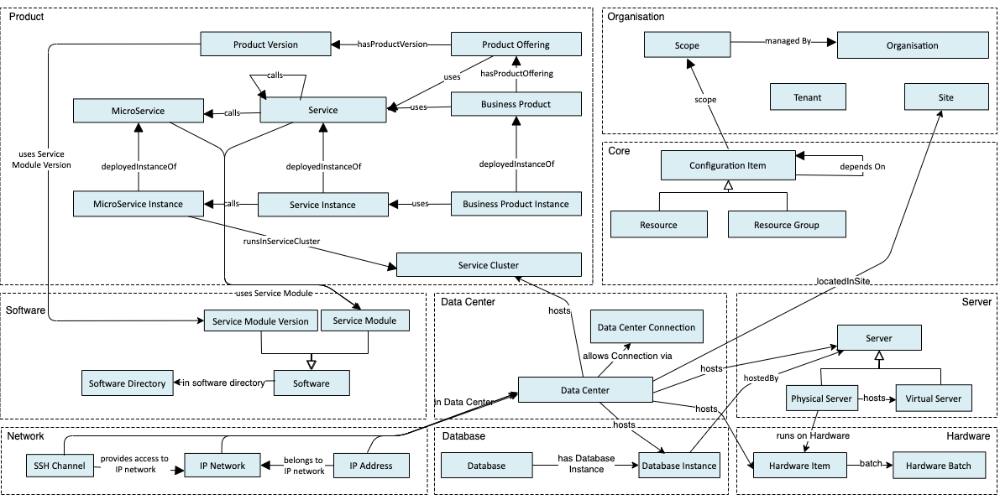

# 收集方法
这里会总结各种用于智能运维的方法。
	 
## 如何构图

* 华为本体工程组发布了一套基于本体论的图谱建设方案，如下图所示。 但是存在若干比较严重的问题：首先，该工作是爱尔团队做的，基本没有中文资料及推广，关注度相当低；其次，论文中提到的工具同样属于小众工具，使用并不方便（反正我没用成功，建议别用mac尝试）；最后，场景还是有较大差异，参考为主。
	* Paper: [A High-Level Ontology Network for ICT Infrastructures](https://davidchavesfraga.com/outcomes/papers/2021/corcho2021high.pdf)
	* Github：[https://github.com/oeg-upm/devops-infra](https://github.com/oeg-upm/devops-infra)

  

