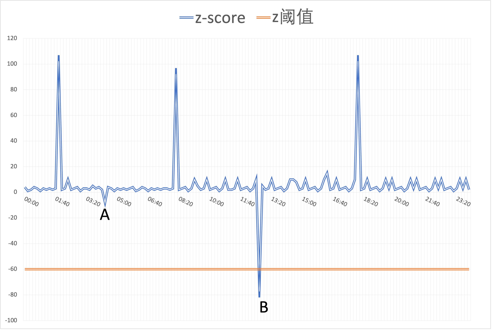
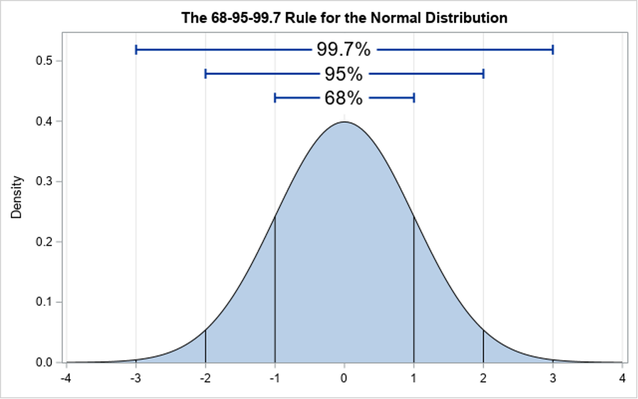

# 基于概率的方法
这里主要收集以统计分析为主用于解决的运维场景和问题。

## 二项分布如何用于网络判障

* 场景

探测内网连通性（机房到机房），以服务器 $a$ 去探测服务器 $b$ 为例，每次探测有两种结果（成功，失败），假设发出 $n$ 个数据包，其中 $m$ 个成功， $n-m$ 个失败。 

* 问题

理论上，网络状态正常， $m/n=100$% ，但实际上由于各种不确定性因素（服务器负载高、服务器重启，等），少量的数据包失败是可接受的。因此，需要设定一个判障阈值。

* 需求

人工设置阈值不合理，因为服务器之间连接情况不同，系统复杂且动态运行。判障算法要求是通用的、低开销的、高鲁棒性的。不能针对具体任务训练阈值，这样维护成本很大。

* 难点
	* 难点一：数据噪声。如服务器负载高、机器重启等，这些事件不能说明网络存在问题。
	* 难点二：不同任务的采样数量差距大。由于网络结构不同，以及数据噪声，小样本的探测任务难以准确判障。

* 方案

	* 将网络连接探测看作为伯努利试验。假设收发的数据包为相互独立的样本（成功 or 失败），服从二项分布 $B(n，p)$ ，其中 $n$ 表示数据包个数， $p$ 表示网络正常状态下探测的成功概率。
求 $P(x<=m)$ 的值，即探测失败的概率。

	* 根据中心极限定理，二项分布近似服从正态分布，因此可通过计算 $Z-Score$ 值代替 $P(x<=m)$ 。 
		
		* 计算 $Z-Score$ ：
			
			$$
			\begin{aligned}
			Z= \frac{X-\mu}{\sigma}
			&= \frac{X-np}{\sqrt{np\left(1-p\right)}} 
			\end{aligned}
			$$
			
		* 网络正常状态下探测的成功概率 $p$ ，可通过人工设置阈值，或者极大似然估计。     
		* 设定初始阈值  $z_0$ ，当 $Z$ 值小于 $z_0$ 时，进行故障检测。

  

* 补充说明
	* 难点二的用例。假设任务 $a$ 发送100个样本，成功收到60个样本，任务 $b$ 发送10个样本，成功收到6个样本，表面上 $m/n=60$%，网络探测成功率相同。通过计算 $Z-Score$ 可得 $z_a=-5$ ， $z_b=-1.12$ ，两者具有明显差异。
	* 针对业务和应用的周期变化不同，可以按时间进行划分，分别计算阈值。比如，中午比晚上交易量大，计算负载高，网络链接阈值可以设置不同。比如，每台服务器设置24个阈值，重大节日采用特定阈值。

* 参考资料：[二项分布为何能在网络判障中发挥大作用？](https://mp.weixin.qq.com/s?src=11&timestamp=1659960263&ver=3970&signature=ZB4JYkGEIRdseUjXmjdh77z9oCuxWCfi12PbpJi1rWzPWt9gi2eNxHqpO7THdxIlxColdEDnvVb8V81htH2w-mCOJOQXa8PsXGGPlfZzU5eN4QrKnqIO5T1AuR7jzmL7&new=1)	

## 柏松分布如何做流量异常检测

* 场景

流量能够反映系统的运行状态。流量通常平稳波动，当流量出现异常突升或突降，说明系统可能出现故障。例如，网络故障导致系统无法接收访问请求，从而导致流量突降。

* 流量异常检测，包括如下两个阶段
	* 阶段一：预测。
		* 如何对流量进行精准预测。
		* 这里主要挑战是，导致流量突变的因素多变，如业务调整、外部攻击、系统故障，等。
		* 算法需要适应变化，进一步能够区分各种情况。

	*  阶段二：预警。
		* 如何对异常进行正确报警。
		* 这里主要挑战是，流量波动存在较大差异。比如，白天流量大，预测相差10%是异常，夜间流量小，相差20%都是正常的。导致无法采用残差与相对残差等方法建立统一阈值。
		* 算法需要提供一套在不同情况下界定异常的方法。

* 流量预测

文献中采用鲁棒回归算法。更合理的做法是集合学习：采用一揽子预测模型，以及自适应调优。其假设是，导致流量变化的因素在发生变化，不同模型适用的情况不同，通过动态调整模型权重进行判断。

关于这部分的问题和解决方案，将在时间序列模式中进行详细阐述。

* 基于泊松分布的预警（异常检测）

	* 泊松分布适用于流量建模。流量是指系统一段时间内接受到请求的次数，而泊松分布是描述单位时间内随机事件发生的次数。

	* 假设一段时间 $t$ 的用户请求数（流量），真实值为  $y_t$，预测值为 $\hat{y_t}$ ，计算两者之间的差异，
		* 泊松分布：

		  $$ \begin{aligned}  P(k=y_{t}; \lambda=\hat{y_{t}})=\frac{\lambda ^{k}}{k!}{e ^{-\lambda}}=\frac{\hat{y_{t}} ^{y_{t}}}{y_{t}!}{e ^{-\hat{y_{t}}}} \end{aligned} $$
		
		* 由于计算开销大，这里同样采用正态分布近似泊松分布， 计算 $Z$ 值：

		  $$ \begin{aligned} Z=\frac{y_{t}-\hat{y_{t}}}{\sqrt{\hat{y_{t}}}} \end{aligned} $$

		* 关于如何界定异常（建立统一检测阈值）

  

* 补充说明：
	* 预警难点的用例。如上图所示，点 $A$ 表示夜间的实际流量为300，预测值为380；点 $B$ 表示中午实际流量情况为400000，预测流量情况为450000。虽然点 $A$ 预测差异在20%，点 $B$ 预测差异在10%，但 $z_A = -8.9$ ， $z_B = -74$ ， $z_B$ 低于于阈值 -60，说明B为流量异常点，需检测。
		

* 参考资料：[我们不一样！告诉你百度是如何做智能流量异常检测的](https://cloud.tencent.com/developer/news/291894) 

## 如何监测响应时间（正态分布，高斯核密度估计）

* 场景

响应时间是指系统处理请求的时间。这类指标能够反应应用和系统问题。首先，用户可能因为等待时间长转而使用更快的竞品。其次，造成响应慢有多种原因，如网络延迟、IO等待、进程阻塞。

* 正态分布（k-sigma 算法）
	* 通常情况下，可以假设响应时间服从正态分布，即 $x_{t} \sim \mathcal{N}(\mu,\sigma^{2})$ 

	* 参数估计
	
	$$ \begin{aligned} \mu = \bar{x} = \frac{x_{1}+x_{2}+\dots+x_{n}}{n} \end{aligned} $$
	
	$$ \begin{aligned} \sigma = s = \sqrt{ \frac{ \sum \limits_{i=1}^{n} \left(x_{i}-\bar{x}\right)^{2}}{n-1}} \end{aligned} $$

	* 计算概率

  

* 核密度估计（KDE）算法
	* 该算法可以为不同类型的监控指标数据估算何时的概率分布；
	*  KDE 是一个种非参数化方法，基于随机变量的观测样本估计其概率密度，公式如下，
	
	$$ \begin{aligned} 
\hat{f}(x)=\frac{1}{n} \sum_{i=1}^n K\left(x ; x_i\right)
\end{aligned} $$

	*  其中，$ K $ 表示核函数（默认 Gaussian 分布），另一个可配置参数叫作带宽（平滑参数），算法具体参见 [非参数估计：核密度估计KDE](https://blog.csdn.net/pipisorry/article/details/53635895) 

* 前处理

这部分需要通过实操总结经验。比如，数据聚类剔除极端异常值。

## Linux 系统的标准监控指标及经验分布
<table>
    <tr>
        <td>类型</td>
        <td align="center">监控指标</td>
	<td align="center">说明</td>
	<td>经验分布</td>    
    </tr>
    <tr>
        <td rowspan="8">CPU</td>
	<td>CPU_IDLE</td>	
	<td>空闲百分比</td>
	<td rowspan="2">贝塔分布</td> 
    </tr>
    <tr>	
	<td>CPU_HT_IDLE</td>	
	<td>超线程空闲百分比</td>
    </tr>
    <tr>
	<td>CPU_CONTEXT_SWITCH</td>	
	<td>上下文切换次数</td>
	<td>泊松分布</td>
    </tr>
    <tr>
	<td>CPU_INTERRUPT</td>	
	<td>中断次数</td>
	<td rowspan="5">高斯分布</td> 	
    </tr>
    <tr>
        <td>CPU_SERVER_LOADAVG_1</td>	
        <td>1分钟前到现在的负载平均值</td>
    </tr>
    <tr>	
	<td>CPU_SERVER_LOADAVG_5</td>	
	<td>5分钟前到现在的负载平均值</td>	    
    </tr>
    <tr>	 
	<td>CPU_SERVER_LOADAVG_15</td>	
	<td>15分钟前到现在的负载平均值</td>   
    </tr>
    <tr>
	<td>CPU_WAIT_IO</td>
	<td>等待IO占CPU百分比</td>
    </tr>
    <tr> 
        <td rowspan="15">磁盘 </td>
        <td>DISK_TOTAL_USED_PERCENT</td>	
        <td>总磁盘使用率</td>	
        <td rowspan="3">贝塔分布</td> 
    </tr>
    <tr> 
	<td>FD_USED_PERCENT</td> 	
	<td>整机的fd使用率</td>   
    </tr>	
    <tr> 
        <td>DISK_TOTAL_INODE_USED_PERCENT</td> 	
        <td>磁盘总inode使用率</td> 	
    </tr>
    <tr> 
        <td>DISK_FS_ERROR</td> 	
        <td>磁盘错误</td> 	
        <td rowspan="2">泊松分布</td>  
    </tr>
    <tr> 
	<td>FD_USED</td> 	
	<td>整机已使用fd个数</td>  
    </tr>	
    <tr> 
  	<td>DISK_PAGE_IN</td>  	
    	<td>分页从磁盘重新回到内存</td>  	
    	<td rowspan="10">高斯分布</td>   
    </tr>
    <tr> 
   	<td>DISK_PAGE_OUT</td>	
    	<td>分页写入磁盘</td>
    </tr>
    <tr> 
    	<td>DISK_TOTAL_AVG_WAIT</td>	
    	<td>整机的磁盘平均等待时间</td>
    </tr>
    <tr> 
    	<td>DISK_TOTAL_IO_UTIL</td>	
    	<td>整机的磁盘IO使用百分比</td>
    </tr>
    <tr> 
    	<td>DISK_TOTAL_READ_KB</td>	
    	<td>整机的磁盘的读速率</td>
    </tr>
    <tr> 
    	<td>DISK_TOTAL_READ_REQ</td>	
    	<td>整机的磁盘读取请求数</td> 
    </tr>
    <tr> 
     	<td>DISK_TOTAL_READ_AVG_WAIT</td>	
    	<td>整机的磁盘读操作平均等待时间</td>
    </tr>
    <tr> 
    	<td>DISK_TOTAL_WRITE_KB</td>	
    	<td>整机的磁盘写速率</td>
    </tr>
    <tr> 
    	<td>DISK_TOTAL_WRITE_REQ</td>	
    	<td>整机的磁盘写入请求数</td>
    </tr>
    <tr>  
    	<td>DISK_TOTAL_WRITE_AVG_WAIT</td>	
    	<td>磁盘总的写操作平均等待时间</td>
    </tr>
    <tr> 
	<td rowspan="6">内存 </td>
    	<td>MEM_USED_PERCENT</td>	
    	<td>内存使用率</td>	
    	<td rowspan="2">贝塔分布</td> 
    </tr>
    <tr> 
    	<td>MEM_USED_ADD_SHMEM_PERCENT</td> 	
    	<td>共享内存使用率</td>   
    </tr>	
    <tr> 
    	<td>MEM_BUFFERS</td> 	
    	<td>缓冲占用的内存容量</td>
    	<td rowspan="3">泊松分布</td>  	
    </tr>
    <tr> 
    	<td>MEM_CACHED</td> 	
    	<td>缓存占用的内存容量</td> 	  
    </tr>
    <tr> 
    	<td>MEM_USED</td> 	
    	<td>系统已使用内存量</td> 	  
    </tr>
    <tr> 
    	<td>MEM_USED_ADD_SHMEM</td> 	
    	<td>系统已使用共享内存量</td> 	   
    </tr>
    <tr> 
    	<td rowspan="13">网络</td>	
    	<td>NET_MAX_NIC_INOUT_PERCENT</td>	
    	<td>网卡入口/出口流量最大使用率</td>	
    	<td>贝塔分布</td>
    </tr>
    <tr> 
    	<td>NET_TCP_IN_ERRS</td>	
    	<td>网络流入错误数</td>	
    	<td rowspan="4">泊松分布</td>
    </tr>
    <tr> 
    	<td>NET_TCP_RETRANS</td>	
    	<td>tcp重传数</td>
    </tr>
    <tr> 
    	<td>NET_TCP_LOSS</td>	
    	<td>tcp丢包而进行恢复的次数</td>	
    </tr>
    <tr> 
    	<td>NET_UP_NIC_NUMBER</td>	
    	<td>网络向上接口数</td>	
    </tr>
    <tr> 
    	<td>NET_TCP_ACTIVE_OPENS</td>	
    	<td>tcp主动打开（连接）数</td>	
    	<td rowspan="8">高斯分布</td>
    </tr>
    <tr> 
   	<td>NET_TCP_CURR_ESTAB</td>	
    	<td>当前已建立tcp连接数量</td>
    </tr>
    <tr> 
    	<td>NET_TCP_IN_SEGS</td> 	
    	<td>tcp协议层收到的数据包数</td>
    </tr>
    <tr> 
    	<td>NET_TCP_OUT_SEGS</td>	
    	<td>tcp协议层发出的数据包数</td>
    </tr>
    <tr> 
    	<td>NET_TCP_TIME_WAIT</td>	
    	<td>处于time_wait状态的tcp连接数</td>
    </tr>
    <tr> 
    	<td>NET_TOTAL_IN_BITPS</td>	
    	<td>网络流入速度</td>
    </tr>
    <tr> 
    	<td>NET_TOTAL_OUT_BITPS</td>	
    	<td>网络流出速度</td>
    </tr>
    <tr> 
    	<td>NET_TOTAL_SOCKETS_USED</td> 	
    	<td>已使用的所有协议套接字总量</td>
    </tr>
    <tr> 
    	<td rowspan="5">OS内核 </td>
    	<td>SYS_OOM</td>	
    	<td>衡量系统超出内存的频率</td>	
    	<td rowspan="5">泊松分布</td> 
    </tr>
    <tr> 
    	<td>SYS_PAGING_PROCS</td> 	
    	<td>系统分页进程数/td>   
    </tr>	
    <tr> 
    	<td>SYS_RUNNING_PROCS</td> 	
    	<td>系统运行中进程数</td>   
    </tr>
    <tr> 
    	<td>SYS_STOPPED_PROCS</td> 	
    	<td>系统暂停状态进程数</td>   
    </tr>	
    <tr> 
    	<td>SYS_ZOMBIE_PROCS</td> 	
    	<td>系统僵尸进程数</td>   
    </tr>				
</table>

* 参考资料：[百度异常检测实践](https://github.com/transcope/xopshub/blob/main/doc/external/%E7%99%BE%E5%BA%A6%E6%99%BA%E8%83%BD%E5%BC%82%E5%B8%B8%E6%A3%80%E6%B5%8B%E5%AE%9E%E8%B7%B5.pdf)
