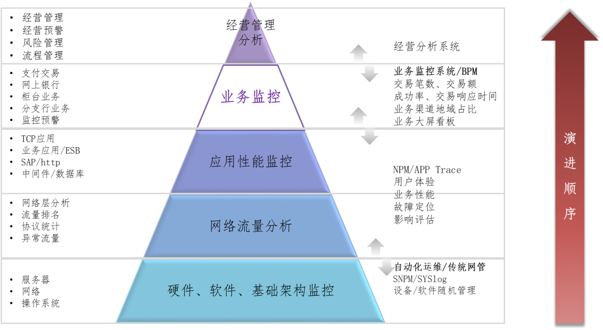

# 报告工作空间
这里会摘录一些有价值的材料，包括框架、思路、想法等相关内容，主要用作客户现场宣讲用素材。

* [运维大数据与监控平台（神舟信息）](http://www.dcits.com/show-450-1054-1.html)

这是关于银行运维大数据监控平台，文章虽然比较久远（2018年），但是想法与时俱进（比如，数据资产），内容有值得借鉴的地方，包括**建设目标**、**业务价值**、产品架构等。尤其是顶层视图展示，将银行从上到下串联起来。虽然落地不太可能落地，个人觉得整体思路适用于宣讲。

  

